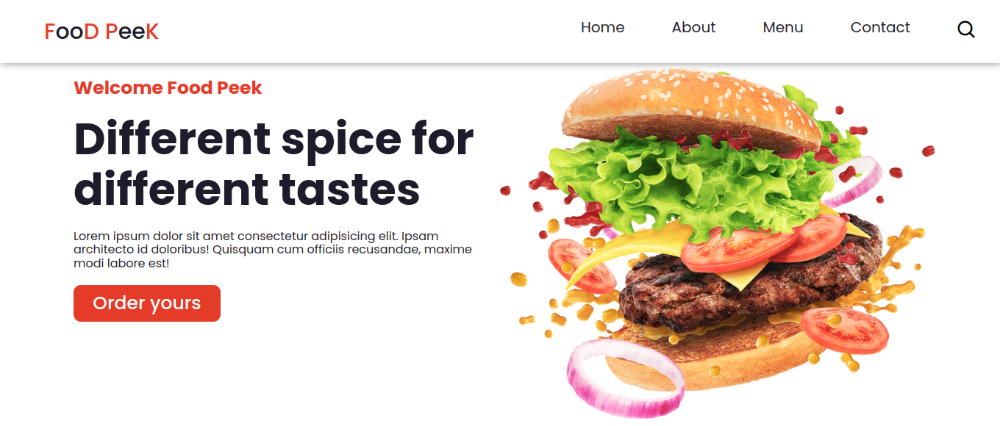

# Responsive Landing Page
 

## :memo: Project Descriptio

This is my  project  developed for learn more and about the media querys and subway menu. Thank you for reading my personal project, I hope you like it and if you have seen any problems or possible improvement for it, please talk to me. 

## [Click here for view the website](https://matheusfeliperuiz.github.io/Product-Preview-Card-Component/)

##  Developed with: 

 <strong> HTML</strong>
 <strong>CSS</strong>
 <strong>SCSS</strong>
 <strong>JavaScript</strong>

          